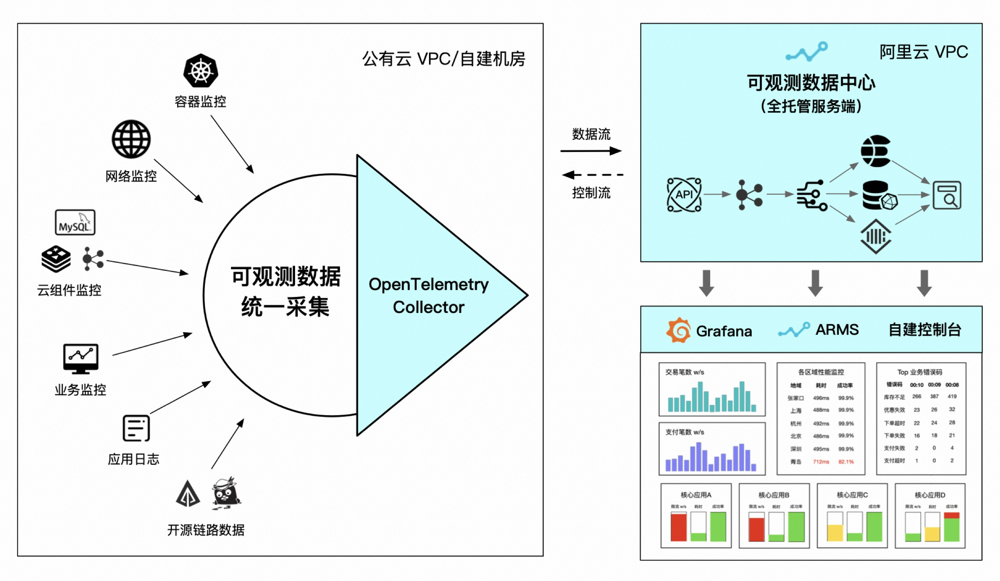
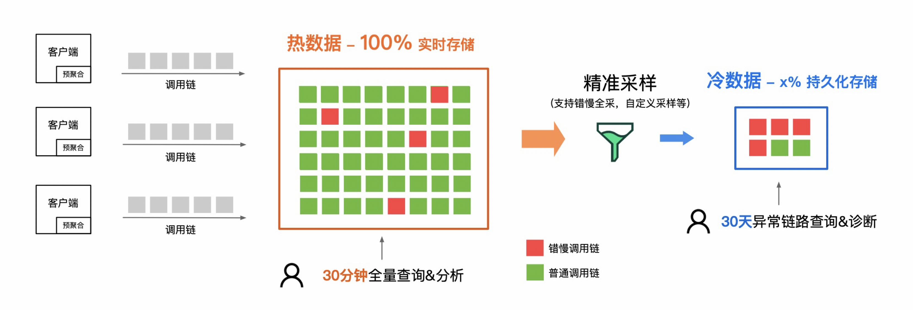
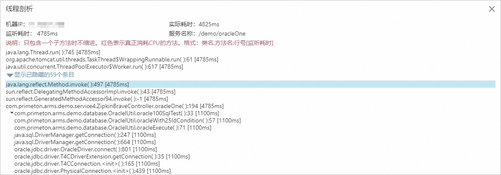
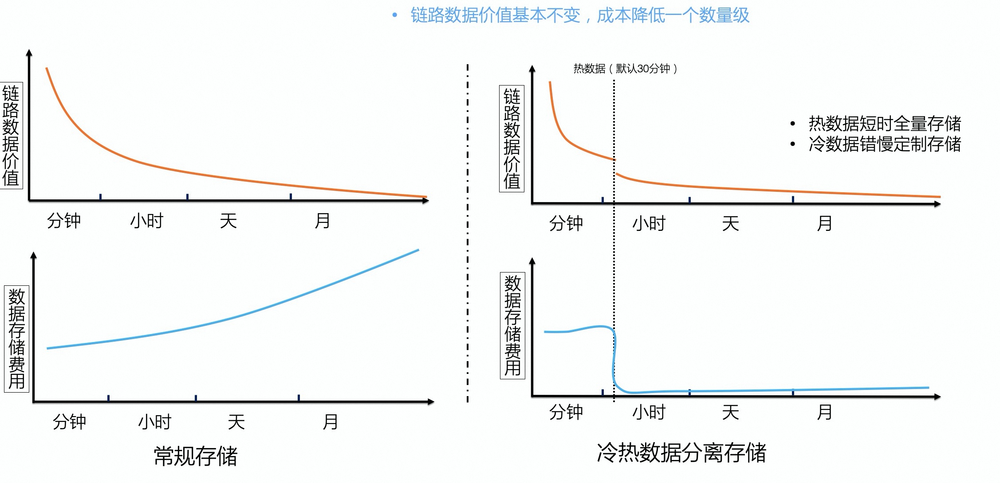
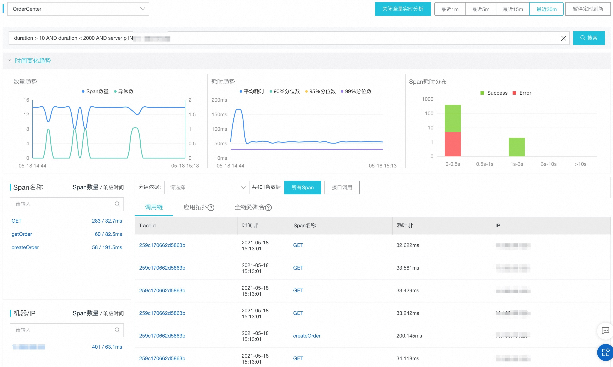

# 链路追踪（Tracing）其实很简单——链路成本进阶指南

> 作者：夏明（涯海）    
> 创作日期：2022-10-26  
> 专栏地址：[【稳定大于一切】](https://github.com/StabilityMan/StabilityGuide) 

广义上的链路成本，既包含使用链路追踪产生的数据生成、采集、计算、存储、查询等额外资源开销，也包含链路系统接入、变更、维护、协作等人力运维成本。为了便于理解，本小节将聚焦在狭义上的链路追踪机器资源成本，人力成本将在下一小节（效率）进行介绍。

## 链路追踪机器成本的组成结构
链路追踪机器成本主要分为客户端和服务端两大类。链路追踪客户端（SDK/Agent）通常运行在业务进程内部，与业务程序共享CPU、内存、网络、磁盘等系统资源。链路追踪的客户端开销主要包括链路埋点拦截、链路数据生成与透传、简单的预聚合或压缩/编码等数据处理、数据缓存与上报等。客户端开销通常属于一种隐性开销，短期内不会直接导致资源账单的增长，而是利用业务进程闲置部分的资源。但是，当业务持续增长或者进入峰值周期（如大促），链路追踪消耗的这部分资源最终会引发实际账单的增长。因此，这部分的开销要严格控制在一个合理的水位之内，比如不超过 10%，否则会显著影响业务的正常运转。

链路追踪的服务端机器成本是一种显性的、即时投入的资源成本，也是在评估链路追踪选型方案时（自建、托管）的重要考量因素。链路追踪的服务端通常由网关、消息缓冲、流计算、存储与查询端组成，最为人们所熟知与关注的是链路存储模块，许多热点文章讨论的链路尾部采样（Tail-based Sampling）主要影响的就是链路追踪服务端存储成本。但是，在短周期存储（如3~7天）场景下，链路数据接收、缓冲与处理的资源成本占比甚至会超过存储，也是不容忽视的重要组成部分。

此外，还有一块容易忽略的成本就是客户端与服务端之间的网络传输费用。特别是在跨公网传输场景下，不但带宽成本高，而且传输流量会受限，经常需要开启头部采样（Head-based Sampling）来降低链路数据上报量。

近年来，主流开源社区或商业化产品陆续推出了边缘集群解决方案，即在用户网络（VPC）下，部署一套可观测数据统一采集与处理集群，支持多源异构数据标准化、链路数据无损统计、错慢全采等特性，可以进一步降低链路数据上报与持久化存储成本。整体架构如下图所示。

## 链路追踪机器成本优化
明晰了链路追踪机器成本的组成结构，我们接下来分析如何进行针对性优化。在这里，先提出三个问题：“每一条链路数据的价值都相等吗？”“对链路数据的加工处理是越早越好，还是越晚越好？”“链路数据的存储时长是越久越好，还是越短越好？”。

为了解答上述疑问，我们要搞清楚链路数据的用法和价值到底是什么？链路数据主要有三种用法，一是根据特定条件筛选并查询单条调用链明细轨迹，用于具体问题的诊断与定位；二是基于固定的维度进行链路预聚合，提供服务接口等通用粒度的监控与告警；三是基于链路明细进行自定义后聚合，满足个性化的链路分析需求，如VIP客户大于3S的慢请求接口分布。

因此，包含不同特征的链路数据价值并不相等，错慢链路或含有特定业务特征的链路（统称为关键链路），往往比普通链路的价值更高，被查询的概率更大。我们应该记录更多的关键链路，并提高其存储时长；普通链路应该更少记录，并降低存储时长。此外，为了保障统计数据的精确度，我们应该尽早完成链路数据的预聚合，这样就可以更早的进行链路采样，降低明细数据的整体上报与存储成本。

综上所述，我们可以从“链路倾斜采样”、“链路计算左移”、“冷热存储分离”等方面进行探索，尝试以最低的成本，按需记录最有价值的链路数据，实现成本与体验的动态平衡与优化，如下图所示。

### 链路倾斜采样，记录更有价值的数据
**链路数据的价值分布是不均匀的。** 据不完全统计，调用链的实际查询率通常小于百万分之一，也就是说，每一百万条调用链，只会有一条被实际查询命中，其他链路几乎都是无效存储。全量存储调用链不仅会造成巨大的成本浪费，也会显著影响整条数据链路的性能及稳定性。因此，链路采样（Trace Samplling）的理念随之诞生。

早在 Google Dapper 论文问世的时候，就提出了基于固定比例进行链路采样的方法，并在 Google 内部生产系统得到了实践检验。比如每 1024 条链路采样记录其中一条，采样比例为 1/1024。但是，固定比例采样仅仅解决了控制链路开销的问题，而忽视了链路价值分布的不均匀性，关键链路与普通链路被采样的概率都是相同的，这就导致许多针对关键链路的查询结果出现未命中，极大影响了问题排查的效率。

那么，我们能否提前预测用户行为，只记录会被查询的链路呢？100% 精准预测非常困难，几乎难以实现，但是根据历史行为和领域经验进行推测，优先记录查询概率更大的链路是比较可行的一种降本方案，这就是链路倾斜采样。

链路倾斜采样通常是针对特定的链路特征（如错、慢、核心接口或自定义业务特征）设置较高的采样比例（如100%）或流量阈值（如前N条/分钟），不符合关键特征的链路以极低的比例采样（如1%）甚至不采样。如下图所示的阿里云链路追踪自定义采样配置页面，用户可以根据自身需要自由定制特征采样策略，在保证较高的查询命中率（如50%+）的前提下，链路数据实际存储量可以达到原始数据量的 5% 左右，极大的节省了服务端持久化存储的成本。更多链路采样策略将在实战篇进行详细介绍，比如动态采样。

延伸一下思路，我们在做问题诊断时，除了调用链之外，通常还需要结合日志、异常堆栈、本地方法耗时、内存快照等关联信息进行综合判断。如果每一次请求的关联信息全都记录下来，大概率会造成系统的崩溃。因此，借鉴“链路倾斜采样”的理念，丢弃无用或低价值数据，保留异常现场或满足特定条件的高价值数据，精细化的按需存储能力应该成为衡量 Tracing 乃至可观测产品优劣的重要标准之一。如下图所示，阿里云 ARMS 产品提供了慢调用场景下自动保留完整本地方法栈的能力，可以实现慢调用的行级代码定位。

### 链路计算左移，提炼数据价值
除了筛选记录更有价值的数据之外，还可以将数据加工计算从服务端“左移”至客户端或边缘集群，提前完成数据价值提炼，如预聚合或压缩编码，这样就可以在满足用户查询需求的前提下，有效节省数据传输与存储成本。

* 预聚合统计：在客户端进行预聚合的最大好处， 就是在不损失数据精度的同时大幅减少数据上报量。 比如，对调用链进行 1% 采样后，仍然可以提供精准的服务概览/上下游等监控告警能力。
* 数据压缩：对重复出现的长文本（如异常堆栈，SQL 语句）进行压缩编码，也可以有效降低网络开销。结合非关键字段模糊化处理效果更佳。

### 冷热存储分离，低成本满足个性化分析需求
链路采样和计算左移的思路都是尽可能减少链路明细数据的上报与存储，从而达到降成本的目的。这两种做法可以比较好的满足单链路查询与通用场景下的预聚合监控告警，但却无法满足多样化的后聚合分析需求，比如某个业务需要统计耗时大于3秒的接口及来源分布，这种个性化的后聚合分析规则是无法穷举的。而当我们无法预先定义分析规则时，貌似就只能采用成本极高的全量原始数据存储。难道就没有优化的空间么？答案也是有的，接下来我们就介绍一种低成本解决后聚合分析问题的方案——冷热存储分离。

冷热存储分离的基础在于用户的查询行为满足时间上的局部性原理。简单理解就是，时间越近的热数据查询概率越大，时间越久的冷数据查询概率越小。例如，由于问题诊断的时效性，50% 以上的链路查询分析发生在 30分钟内，7天之后的链路查询通常集中在错慢调用链。理论基础成立，接下来讨论如何实现冷热存储分离。

首先，热数据存在时效性，如果只需记录最近一段时间内的热数据，对于存储空间的要求就会下降很多。另外，在公有云环境下，不同用户的数据天然具备隔离性。因此，在用户 VPC 内部的热数据计算和存储方案就具备更优的性价比。

其次，冷数据的查询具备指向性，可以通过不同的采样策略筛选出满足诊断需求的冷数据进行持久化存储。例如错慢采样，特定业务场景采样等。由于冷数据存储周期较长，对稳定性要求较高，可以考虑在共享数据中心统一管理。

综上所述，热数据存储周期短，成本低，但可以满足实时全量后聚合分析需求；而冷数据经过精准采样后数据总量大幅下降，通常只有原始数据量的 1% ~10%，并可以满足大多数场景的诊断诉求。两相结合，实现了成本与体验的平衡最优解。国内外领先的 APM 产品，如 ARMS、Datadog、Lightstep 均采用了冷热数据分离的存储方案。

冷热存储分离的具体实现方式，以及不同存储的选型比对，我们将在实战篇进行详细解读。下图展示了阿里云链路追踪提供的 30分钟热数据全量分析的示意图。

## 小结
随着云原生与微服务架构的兴起，可观测数据量（Traces、Logs、Metrics）呈现爆发式增长态势，越来越多的企业开始重视可观测的成本管理，FinOps 也成为当下流行的一种新型协同范式。全量数据上报、存储、再分析这种传统方案将面临越来越大的挑战。通过倾斜采样记录更有价值的数据，通过计算左移提炼数据价值，通过冷热存储分离实现更高性价比的数据价值探索，将逐渐成为云原生时代的主流方案，让我们一起来探索实践吧！

## 推荐阅读
《链路追踪（Tracing）其实很简单》系列文章

- 1 什么是分布式链路追踪
	- [1.1 分布式链路追踪的起源](./链路追踪其实很简单——分布式链路追踪的起源.md)
	- [1.2 分布式链路追踪的诞生](./链路追踪其实很简单——分布式链路追踪的诞生.md)
	- [1.3 分布式链路追踪的应用与兴起](./链路追踪其实很简单——分布式链路追踪的应用与兴起.md)
	- [1.4 分布式链路追踪的挑战与限制](./链路追踪其实很简单——分布式链路追踪的挑战与限制.md)
- 2 分布式链路追踪的基础用法
	- [2.1 请求轨迹回溯](./链路追踪其实很简单——请求轨迹回溯.md)
	- [2.2 多维链路筛选](./链路追踪其实很简单——多维链路筛选.md)
	- [2.3 链路实时分析、监控与告警](./链路追踪其实很简单——链路实时分析_监控与告警.md)
	- [2.4 链路拓扑](./链路追踪其实很简单——链路拓扑.md)
- 3 分布式链路追踪的进阶指南
	- [3.1 链路功能进阶指南](./链路追踪其实很简单——链路功能进阶指南.md)
	- [3.2 链路成本进阶指南](./链路追踪其实很简单——链路成本进阶指南.md)
- 4 分布式链路追踪最佳实践
	- [4.1 链路诊断1分钟定位错慢根因](./链路追踪其实很简单——链路诊断1分钟定位错慢根因.md)

## 推荐产品
- [阿里云 ARMS 可观测](https://help.aliyun.com/product/34364.html)
- [阿里云链路追踪](https://help.aliyun.com/document_detail/196681.html)

## 推荐社区
【稳定大于一切】打造国内稳定性领域知识库，**让无法解决的问题少一点点，让世界的确定性多一点点。**

- GitHub 专栏地址：[https://github.com/StabilityMan/StabilityGuide](https://github.com/StabilityMan/StabilityGuide)
- 微信公众号：万物可观测
- 钉钉交流群号：30000312
- 如果阅读本文有所收获，欢迎分享给身边的朋友，期待更多同学的加入！

